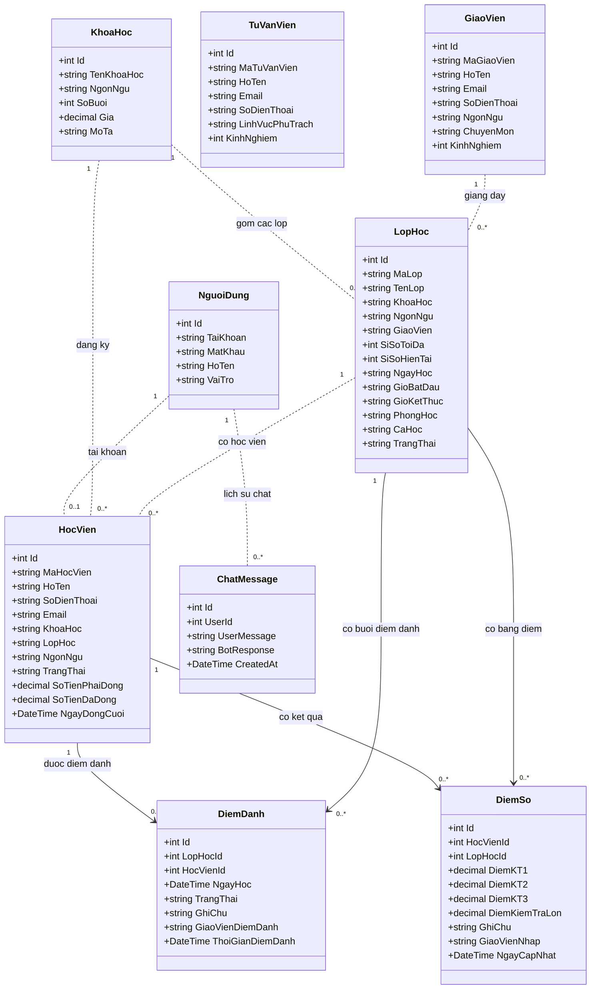

# Domain Model hệ thống Trungtamai

Ảnh sơ đồ: [domain-model-trungtamai.svg](domain-model-trungtamai.svg)

Sơ đồ dưới đây mô tả các thực thể nghiệp vụ chính của hệ thống và các liên kết logic đang thể hiện trong mã nguồn. Một số liên kết như `HocVien - LopHoc` và `LopHoc - GiaoVien` hiện được lưu bằng mã/tên chuỗi, chưa phải navigation property hoặc foreign key bắt buộc của Entity Framework.

## Ý nghĩa nghiệp vụ

| Thực thể      | Vai trò                                                                        |
| ------------- | ------------------------------------------------------------------------------ |
| `NguoiDung`   | Xác thực tài khoản và phân quyền `QuanLy`, `GiaoVien`, `HocVien`, `TuVanVien`. |
| `KhoaHoc`     | Mô tả khóa học, ngôn ngữ, số buổi và học phí.                                  |
| `LopHoc`      | Tổ chức lớp, giáo viên, lịch học, phòng học và sĩ số.                          |
| `HocVien`     | Lưu thông tin học viên, trạng thái học và tình trạng học phí.                  |
| `GiaoVien`    | Lưu thông tin giảng viên và chuyên môn.                                        |
| `TuVanVien`   | Lưu thông tin nhân viên tư vấn khóa học.                                       |
| `DiemDanh`    | Ghi nhận việc tham dự của học viên theo lớp và ngày học.                       |
| `DiemSo`      | Lưu các điểm kiểm tra của học viên trong lớp.                                  |
| `ChatMessage` | Lưu lịch sử trao đổi giữa người dùng và chatbot.                               |

## Quy tắc nghiệp vụ chính

- Chỉ tài khoản có vai trò phù hợp mới được truy cập chức năng tương ứng.
- Một học viên được gắn với khóa học và lớp học.
- Không thêm học viên nếu lớp đã đạt `SiSoToiDa`.
- Khi thêm học viên, hệ thống tạo đồng thời hồ sơ `HocVien` và tài khoản `NguoiDung`.
- Giá trị học phí phải đóng được lấy từ giá của `KhoaHoc`.
- Giáo viên có thể nhập điểm và điểm danh cho học viên trong lớp phụ trách.
