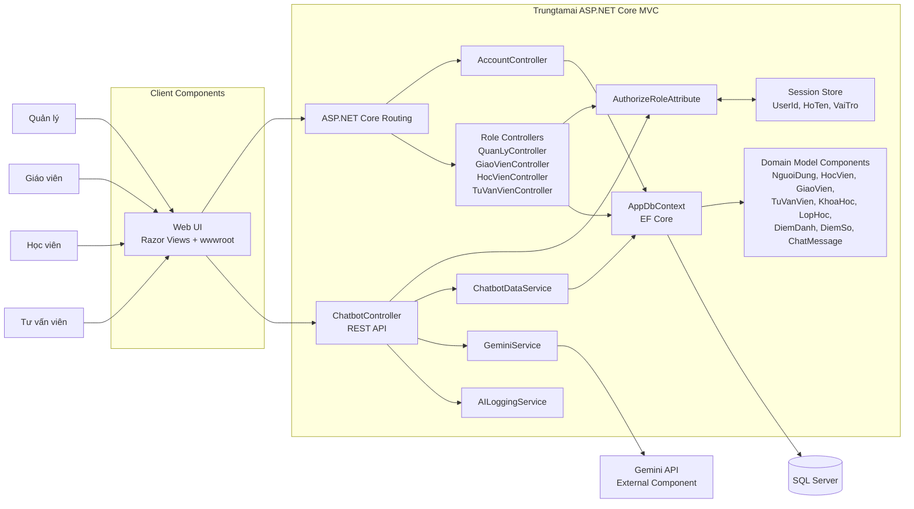
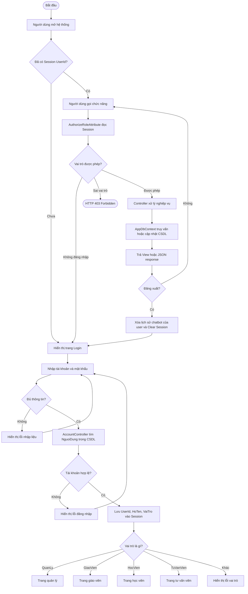
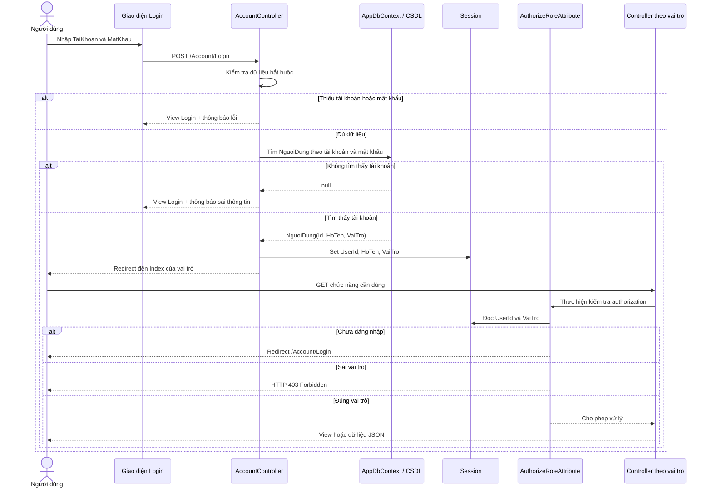
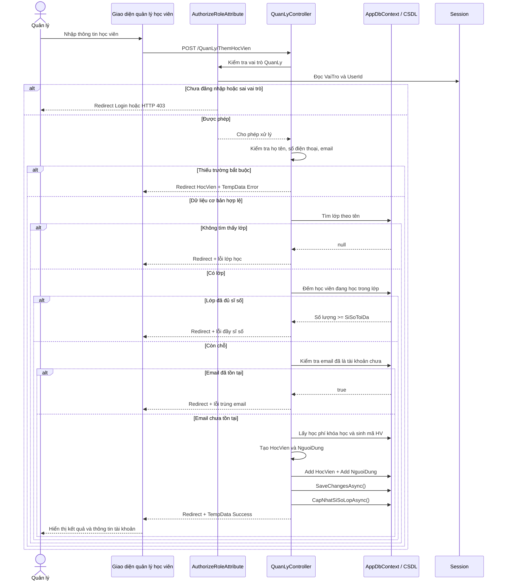

# Sơ đồ UML hệ thống Trungtamai

Domain Model: [DOMAIN_MODEL.md](DOMAIN_MODEL.md)

Tài liệu này mô tả các luồng chính đang được triển khai trong ứng dụng ASP.NET Core MVC:

- Người dùng đăng nhập và được điều hướng theo vai trò.
- Middleware phân quyền kiểm tra Session trước khi cho phép truy cập controller.
- Quản lý thêm học viên, tạo tài khoản đăng nhập và cập nhật sĩ số lớp.

## 0. Biểu đồ thành phần hệ thống hiện tại

Đây là biểu đồ thành phần (UML Component Diagram) của hệ thống đang có trong mã
nguồn. Các khối bên trong ứng dụng là component phần mềm; các đường nối thể hiện
quan hệ gọi hoặc phụ thuộc, không khẳng định mỗi khối là một microservice riêng.

Ảnh biểu đồ: [component-diagram-trungtamai.svg](component-diagram-trungtamai.svg)

### Phạm vi được xác nhận

- Bốn actor hiện có: `QuanLy`, `GiaoVien`, `HocVien`, `TuVanVien`.
- Các component controller hiện có: `AccountController`, `QuanLyController`, `GiaoVienController`, `HocVienController`, `TuVanVienController` và `ChatbotController`.
- Phân quyền dùng `AuthorizeRoleAttribute` và ASP.NET Core Session.
- Dữ liệu nghiệp vụ được truy cập qua `AppDbContext` và Entity Framework Core.
- Chatbot gọi `GeminiService`, lấy dữ liệu được phép xem qua `ChatbotDataService` và lưu lịch sử vào `ChatMessage`.
- Qdrant, dịch vụ AI chấm điểm, phân tích dự đoán, lưu trữ tệp và cổng thanh toán không được đưa vào vì chưa có component triển khai tương ứng trong code hiện tại.

## 1. Sơ đồ hoạt động tổng quát

Ảnh sơ đồ hoạt động: [so-do-hoat-dong-trungtamai-gon.svg](so-do-hoat-dong-trungtamai-gon.svg)

## 2. Sơ đồ trình tự: đăng nhập và phân quyền

## 3. Sơ đồ trình tự: quản lý thêm học viên

## 4. Quy ước ký hiệu

| Ký hiệu                    | Ý nghĩa                                     |
| -------------------------- | ------------------------------------------- |
| Hình tròn bắt đầu/kết thúc | Điểm bắt đầu hoặc kết thúc luồng hoạt động  |
| Hình thoi                  | Điều kiện rẽ nhánh                          |
| Mũi tên                    | Thứ tự chuyển trạng thái hoặc thông điệp    |
| `actor`                    | Người dùng hoặc tác nhân bên ngoài hệ thống |
| `participant`              | Thành phần phần mềm tham gia trao đổi       |
| `alt`                      | Nhánh điều kiện trong sơ đồ trình tự        |
